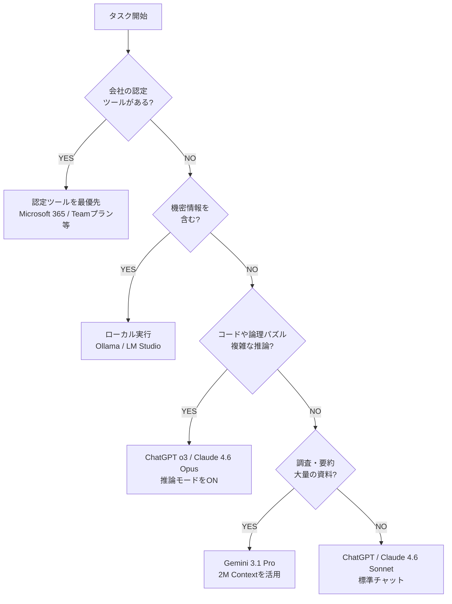

# 2.2 生成AIツールの種類と特徴

> **本セクションの目標:** 主要な生成AIツールの特徴（推論モデル、エージェントAI等）を把握し、目的に応じて最適なツールを選択・構成できる。

---

## 本セクションの狙い

2026年現在、生成AIは単なる「回答マシン」から、複雑な思考を行う「推論モデル」や、自律的にタスクを完遂する「エージェントAI」へと進化しました。本セクションでは、膨大なツールの中からまず押さえるべき「標準的な構成」と、用途別の使い分けを学びます。

### 期待される学習効果

1. **推論モデル(Reasoning Models)の使い分け:** GPT-5やClaude 4.6等のコストが高いが高度な思考が可能なモデルをいつ使うべきか判断できる。
2. **エージェントツールの活用:** CursorやGitHub Copilotのエージェント機能を使い、マルチファイル編集や自律的なデバッグを行える。
3. **コスパ最強構成の構築:** 予算と目的に応じた、自分専用のAIツールセットを構築できる。

---

## ツール全体マップ（2026年最新版）

```txt
生成AIツールの分類
├── 推論・思考特化型（Frontier Models）
│   ├── ChatGPT (OpenAI - GPT-5.4 / o3 / o4)
│   ├── Claude (Anthropic - Claude 4.6 Opus/Sonnet)
│   └── Gemini (Google - Gemini 3.1 Pro / Deep Think)
│
├── エージェント実行型（Agentic AI）
│   ├── Microsoft 365 Copilot (ビジネスプロセス自動化)
│   ├── Cursor / GitHub Copilot Agents (コーディング完全代行)
│   └── Perplexity AI (自律型リサーチエージェント)
│
├── 業務統合・自動化型
│   ├── Google Workspace Gemini (1.5M Context活用)
│   └── Zapier / Make AI Agents (アプリ間連携エージェント)
│
├── 特化型・マルチモーダル
│   ├── Midjourney / DALL-E 4（画像）
│   ├── Sora / Runway Gen-4（動画）
│   └── ElevenLabs / Suno V4（音声・音楽）
│
└── ローカル実行型（Privacy Focused）
    ├── Ollama (Llama 4 / Mistral 2026)
    └── LM Studio / Jan.ai
```

---

## 主要チャット・推論ツール比較

### ChatGPT（OpenAI）

| 項目       | 内容                                                                      |
| ---------- | ------------------------------------------------------------------------- |
| 料金       | Free / Plus $20/月 / Pro $200/月（専用演算資源）                          |
| 主要モデル | GPT-5.4, o3 (Thinking Mode), o4-mini                                      |
| 強み       | **「思考モード(Thinking)」**による圧倒的推論力、DALL-E 4による画像生成。  |
| 特徴       | エージェント機能が高度化。指示ひとつでWeb検索・分析・ツール実行を自律化。 |
| URL        | [https://chatgpt.com](https://chatgpt.com)                                |

### Claude（Anthropic）

| 項目       | 内容                                                                        |
| ---------- | --------------------------------------------------------------------------- |
| 料金       | Free / Pro $20/月 / Team $25/ユーザー/月                                    |
| 主要モデル | Claude 4.6 Opus / Sonnet 4.6                                                |
| 強み       | **「Adaptive Thinking」**。AIが必要に応じて思考の深さを自動調整。高安全性。 |
| 特徴       | **Computer Use**機能。AIがブラウザやデスクトップを操作してタスクを完遂。    |
| URL        | [https://claude.ai](https://claude.ai)                                      |

### Gemini（Google）

| 項目       | 内容                                                                        |
| ---------- | --------------------------------------------------------------------------- |
| 料金       | Free / Advanced (Google One Premium $20/月)                                 |
| 主要モデル | Gemini 3.1 Pro, Gemini 2.5 Flash                                            |
| 強み       | **200万トークンの巨大コンテキスト**。膨大な資料や動画を一度に読み込み可能。 |
| 特徴       | Google Workspace (Drive/Keep等) とのシームレスな連携と統合リサーチ。        |
| URL        | [https://gemini.google.com](https://gemini.google.com)                      |

---

## 開発支援ツール（エンジニア必須）

### Cursor (AI-Native IDE)

| 項目 | 内容                                                             |
| ---- | ---------------------------------------------------------------- |
| 料金 | Free / Pro $20/月                                                |
| 強み | **Agent Mode (Composer)**。コードベース全体の推論と一括修正。    |
| 特徴 | 「何を作るか」を伝えるだけで、複数ファイルを自律的に作成・修正。 |
| URL  | [https://cursor.com](https://cursor.com)                         |

### GitHub Copilot

| 項目 | 内容                                                                       |
| ---- | -------------------------------------------------------------------------- |
| 料金 | Individual $10/月 / Business $19/ユーザー/月                               |
| IDE  | VS Code, IntelliJ, Visual Studio 等                                        |
| 強み | **Copilot Extensions / Agents**。GitHubのエコシステムと密連携。            |
| 特徴 | PR作成、ドキュメント生成、テスト実行をエージェントが自律代行。             |
| URL  | [https://github.com/features/copilot](https://github.com/features/copilot) |

---

## 💡 TIPS: 「コスパ最強」ツール構成 （2026年版）

> **推奨セット（迷ったらこれ）:**
>
> 1. **ChatGPT Plus ($20/月)** — 思考・推論・画像生成を幅広くカバー
> 2. **GitHub Copilot ($10/月)** — エンジニアなら必須。開発エージェント
> 3. **Perplexity Pro ($20/月)** — 検索と情報収集に特化（会社支給推奨）
>
> 合計: エンジニアで約5,000〜7,000円/月  
> → これだけで **業務効率が数倍向上** する可能性あり  
>
> 会社がライセンスを持っている場合は、まず **Microsoft 365 Copilot** と **GitHub Copilot** を最大活用しましょう。
> 会社が **Microsoft 365 Copilot** や **GitHub Copilot(Enterprise)** を導入している場合、まずそれを使い倒すのが最も安全かつ効率的です。
> セキュリティ（データが学習に使われない）が保証されているため、機密情報の扱いに適しています。

---

## ローカル実行（プライバシー対策・学習用）

自分のPCでAIを動かすメリット：**完全無料・完全非公開・ネット不要**。

```bash
# Ollama での実行例 (2026年)
ollama run llama4          # Meta Llama 4 (8B相当) - 驚異的な推論力
ollama run mistral-next    # Mistral最新モデル
```

> **必要スペックの目安:**
> **快適:** メモリ 32GB以上, GPU (VRAM) 12GB以上 (Mac M3/M4 Max等)
> **最小:** メモリ 16GB, GPU不要モデルもあり (Llama 4-mini等)

---

## 用途別・ツール選択チャート



---

## 学習効果の確認

このセクションを振り返り、隣の人（または3名1組のグループ）で、以下のワークを行ってください。

> **テーマ：「最適なツールスタックを提案せよ」（20分）**

シナリオ:

あなたは、1,000ファイル規模の既存システムを解析し、バグ修正と新機能追加を任されました。さらに、その修正内容についての技術ドキュメント（日本語）を作成し、チーム全員に共有する必要があります。あなたは月額予算 $50 以内でどのツールを選択し、どう使い分けますか？

1. 理由とともにツール構成（スタック）を書き出す
2. 各ツールの「どの機能（推論/エージェント/コンテキスト等）」を使うか具体的に述べる

> 自分ごととして捉えることで、技術の理解が圧倒的に深まります。

---

**次のセクション →** [2.3 ナレッジの蓄積と活用（MCPサーバー）](./03_knowledge_mcp.md)
